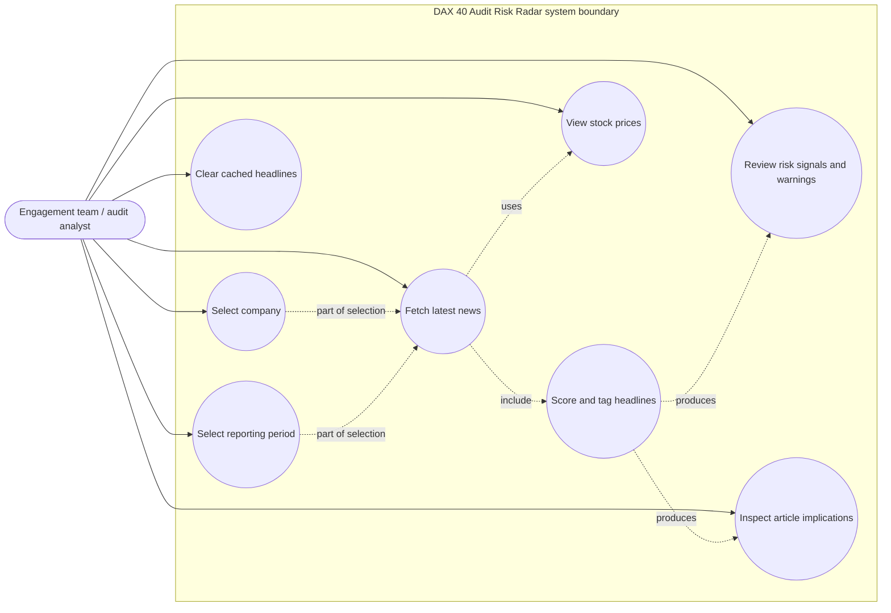

# DAX 40 Audit Risk Radar

Real-time screening of market and news data to detect risk signals, summarize key
developments, and support structured audit risk assessment (ISA 315).

## Recent Updates

- The dashboard is now fully **live-fetch** focused: there is no separate offline
  backfill job or backfill status tracker.
- Reporting windows run from **2025 onward** and are selected by quarter, so
  choosing **Q1-Q4** gives a full-year view.
- Audit keyword and reference mapping lives in the scoring layer, which makes the
  risk labels explainable and ties them back to legal and audit references.
- The news flow combines **NewsAPI** for recent items with **Google News RSS** for
  history, while **GDELT** remains available for raw debugging and fallback checks.
- Coverage is still heuristic, so some companies, especially SAP, may skew toward
  investor-relations and earnings-style coverage until broader keyword search is
  added.

> **Streaming-first:** every value shown in the dashboard is fetched **live from an
> API at request time**. No scraped CSV is read at runtime — the project focuses on
> data streaming, not batch files. The `data/` folder only holds the SQLite cache
> of already-scored headlines.

---

## Use case diagram



## Data flow diagram

```mermaid
flowchart LR
  analyst([Audit analyst])
  newsapi[NewsAPI]
  google[Google News RSS]
  gdelt[GDELT DOC 2.0]
  huggingface[Hugging Face Hub\n(FinBERT / BART)]
  yahoo[Yahoo Finance chart API]

  p1([1.0 Request news])
  p2([2.0 Normalize and score])
  p3([3.0 Store and present results])

  d1[(SQLite headline cache)]

  analyst -->|company + reporting period| p1
  analyst -->|selected tickers| yahoo
  analyst -->|clear cached headlines| d1

  p1 -->|news query| newsapi
  p1 -->|history query| google
  p1 -->|debug query| gdelt

  newsapi -->|headline text| p2
  google -->|headline text| p2
  gdelt -->|headline text| p2
  yahoo -->|price ticks| p3

  p2 -->|model inputs| huggingface
  huggingface -->|sentiment scores + risk tags| p2

  p2 -->|scored headlines| d1
  d1 -->|cached headlines| p3

  p3 -->|warnings + charts| analyst
```

The use case diagram is centered on the external audit analyst and the dashboard
boundary, while the data flow diagram labels each arrow with the data being moved.
That keeps the two diagrams in the correct notation and avoids treating arrows as
generic connections.

The radar itself is part of the visible product output, so the diagrams now show a
dedicated "View risk radar" use case and a "Store and present risk radar" DFD step.

The dashboard flow is intentionally live-first: recent news comes from NewsAPI,
older reporting windows are filled by Google News RSS, and GDELT is kept for raw
debugging or fallback checks. Cached headlines stay in SQLite so repeat views stay
fast, but there is no separate offline backfill process anymore.

Standalone versions are available in [diagrams/use-case-diagram.md](diagrams/use-case-diagram.md)
and [diagrams/data-flow-diagram.md](diagrams/data-flow-diagram.md).

## Data sources (all live APIs)

| Data | Source | Notes |
|------|--------|-------|
| News (recent) | **NewsAPI** `/everything` | Clean JSON, `language=en` or `language=de`, `searchIn=title,description` for relevance. Requires a free API key. |
| News history | **Google News RSS** | Used for the normal historical sample so the selected quarter range still returns articles. |
| GDELT raw debug | **GDELT DOC 2.0** | Diagnostic deep-history checker for cases where the normal news path is sparse or questionable. Rate-limited (1 req / 5 s). |
| Stock prices | **Yahoo Finance chart API** | Direct JSON endpoint, no key. |

**Hybrid news rule** — the requested article window is split across recent NewsAPI
items and historical Google News RSS search results, with GDELT kept for raw debug:

- within the last 30 days → **NewsAPI**
- history windows → **Google News RSS**
- diagnostic deep checks → **GDELT**
- spanning both sources → **merged + de-duplicated** by (company, headline)

Both paths are filtered to **English** and to the **selected company**.

---

## Architecture

```
.
├── app.py              # Streamlit dashboard: UI, manual fetch, scoring orchestration
├── config.py           # DAX 40 companies/tickers, risk labels, NEWSAPI_KEY loading
├── data_sources.py     # Streaming ingest: NewsAPI + Google News RSS history + GDELT debug, Yahoo prices
├── nlp.py              # FinBERT sentiment + BART zero-shot risk-driver extraction
├── audit_references.py # Maps risk drivers -> ISA-315 audit / legal references
├── database.py         # SQLite cache of scored headlines (data/audit_radar.db)
├── .streamlit/config.toml
├── requirements.txt / pyproject.toml / uv.lock
├── data/
│   └── audit_radar.db  # runtime SQLite cache (NOT scraped data)
└── pipeline/           # OPTIONAL legacy batch scrapers — NOT used by the dashboard
```

> `pipeline/` and the CSVs it produces (`data/company_news.csv`, `dax_companies.csv`,
> etc.) are leftovers from an earlier batch design. The streaming dashboard does **not**
> read them; they can be ignored or deleted.

---

## How it works

- **Manual fetch only.** News is fetched **on demand** when you click **🔄 Fetch latest
  news** — there is no automatic timer. The feed otherwise just displays what is already
  scored in the cache.
- **Quarter-based reporting.** The sidebar starts at reporting year **2025** and lets
  you combine any quarters in that year or later, which makes it easier to keep at least
  one full year in scope.
- **Scoring.** Each *new* headline is run through **FinBERT** (`ProsusAI/finbert`) for
  financial sentiment and **BART zero-shot** (`facebook/bart-large-mnli`) for ISA-315
  risk categories, then enriched with audit/legal references.
- **Keyword documentation.** The trigger terms used to explain the model output are
  defined in `config.py` and mapped to legal/audit references in `audit_references.py`.
  The purpose is traceability: the dashboard can show why a headline was tagged, not
  just the tag itself.
- **Investigation flags.** A negative headline above the confidence threshold is flagged:
  its table row is tinted red and its implications headline is shown in red.

### Caching (two layers)

1. **API responses** — `@st.cache_data(ttl=3600)` keeps each NewsAPI/GDELT response for
   **1 hour**, so repeat clicks for the same company/window don't re-hit the APIs.
2. **Scored headlines** — persisted **permanently** in SQLite (`data/audit_radar.db`)
   with a `UNIQUE(company, headline)` constraint, so a headline is only scored once.

Use the **🗑️ Clear cached news** button (sidebar) to wipe both layers and start fresh.

## Quick start

### With uv

```bash
uv sync
uv run streamlit run app.py
```

### With pip

```bash
python -m venv .venv
source .venv/bin/activate        # Windows: .venv\Scripts\activate
pip install -r requirements.txt
streamlit run app.py
```

The dashboard opens at **http://localhost:8501**. The first scoring run loads FinBERT
(~400 MB) and BART (~1.6 GB) from the Hugging Face cache.

> **`accelerate` is required** (already in the dependencies). transformers 5.x loads model
> weights on the `meta` device and needs `accelerate` to move them to CPU — without it you
> get `NotImplementedError: Cannot copy out of meta tensor`.

### Configure the NewsAPI key

Get a free key at <https://newsapi.org>, then create a **`.env`** file in the project root
(it is gitignored; `config.py` loads it automatically):

```
NEWSAPI_KEY=your-key-here
```

GDELT and the Yahoo price API need no key. Without a NewsAPI key, only the GDELT history
path works.

---

## Disclaimer

Decision-support tool for audit planning (ISA 315). Sentiment and risk categories are
model-generated and must be reviewed by the engagement team.
