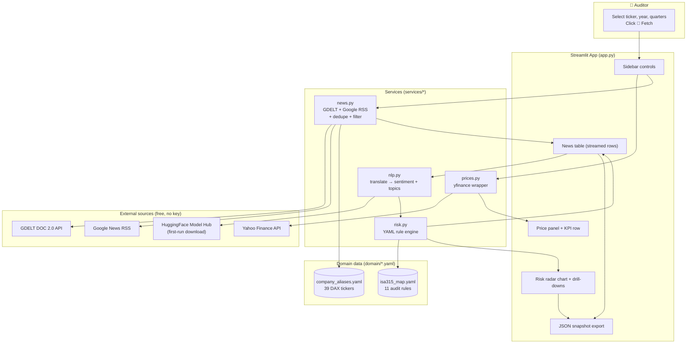
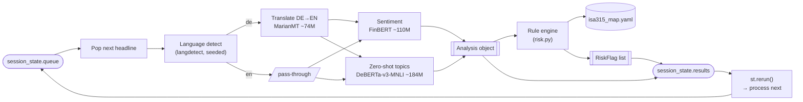
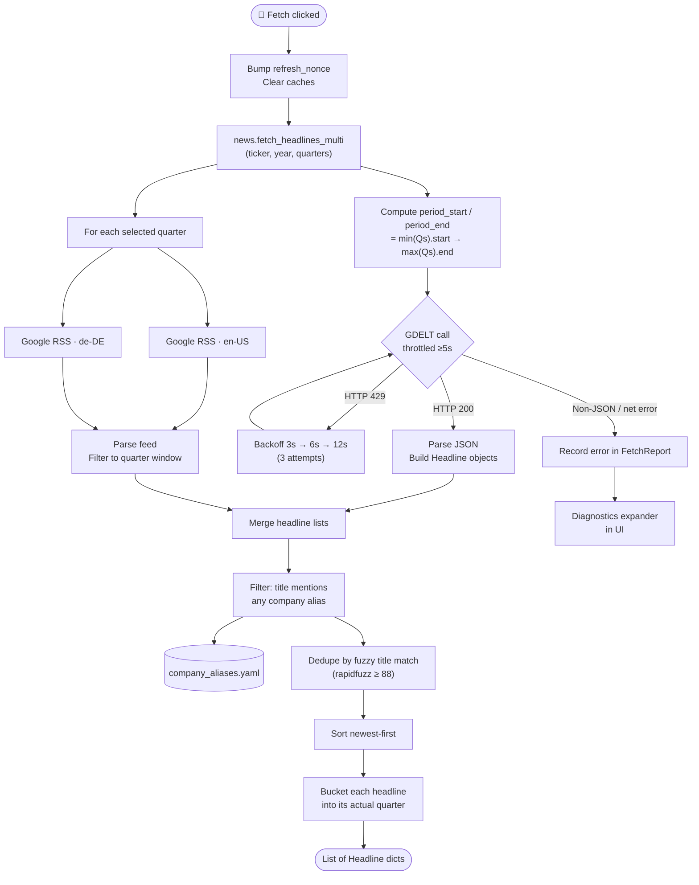
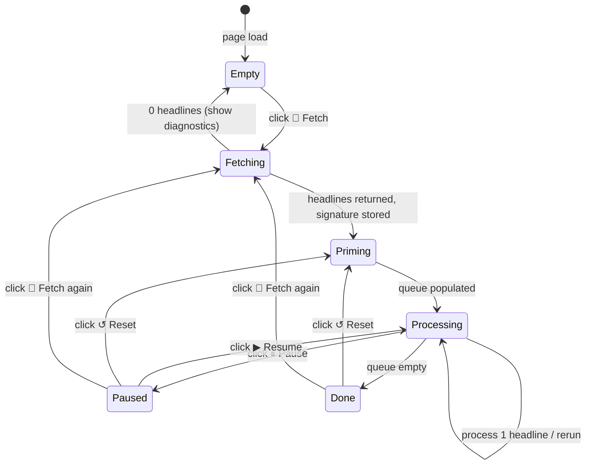
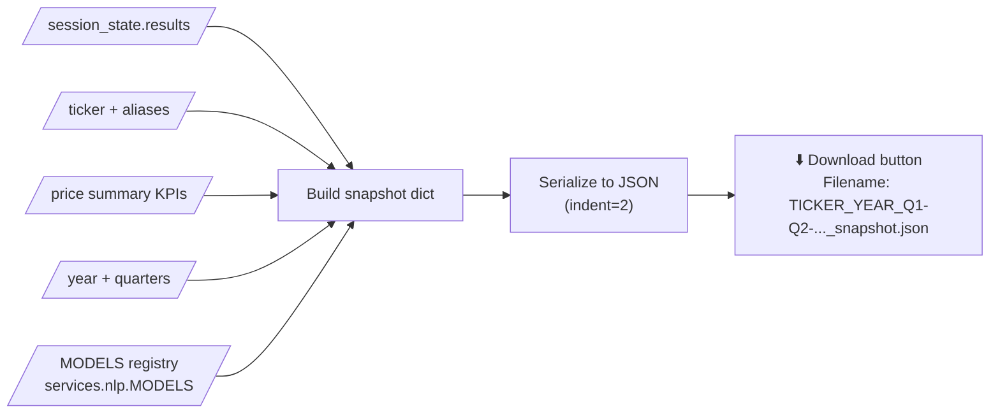

# Data Flow Diagram

End-to-end data flow of the DAX 40 Audit Risk Radar, from user click to
rendered risk flag. All diagrams are Mermaid — GitHub, VS Code, and most
Markdown viewers render them inline.

---

## 1. High-level system view

---

## 2. Per-headline processing pipeline

The streaming pipeline. One headline flows through these stages per
`st.rerun()`; the app processes exactly one row per script pass so that
Pause / Resume buttons remain responsive.

Cache boundaries around this pipeline (all in `app.py`):

- `@st.cache_resource` on `load_models()` — transformers loaded once per
  Streamlit process
- `@st.cache_data` on `cached_analyze(title, hint, topics_key)` — same
  headline text always yields the same output; the cache lets a Reset skip
  redundant re-inference

---

## 3. News fetch flow

Details of how a click on **Fetch latest data** turns into a headline
list. The multi-quarter path collapses GDELT into a single API call to
stay under its rate limit.

---

## 4. State transitions during processing

How `st.session_state` evolves while the pipeline runs. Every rerun of the
Streamlit script inspects this state, processes at most one headline, and
triggers the next rerun.

---

## 5. Snapshot export flow

A workpaper artifact — everything an auditor would need to reproduce the
current view offline.

