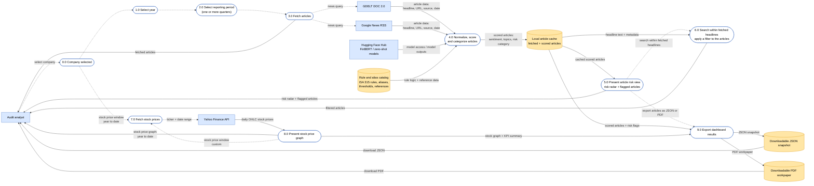

# DAX 40 Audit Risk Radar Data Flow Diagram

```mermaid
flowchart LR

    %% External entity
    auditor["Audit analyst"]

    %% One shared initial selection
    c0(["0.0 Company selected"])

    %% Article flow
    c1(["1.0 Select year"])
    c2(["2.0 Select reporting period<br/>(one or more quarters)"])
    p1(["3.0 Fetch articles"])
    gdelt["GDELT DOC 2.0"]
    google["Google News RSS"]
    p2(["4.0 Normalize, score<br/>and categorize articles"])
    cache[("Local article cache<br/>fetched + scored articles")]
    p3(["5.0 Present article risk view<br/>risk radar + flagged articles"])
    p4(["6.0 Search within fetched headlines<br/>apply a filter to the articles"])

    %% Stock flow
    p5(["7.0 Fetch stock prices"])
    yahoo["Yahoo Finance API"]
    p6(["8.0 Present stock price graph"])

    %% Export flow
    p7(["9.0 Export dashboard results"])
    json[("Downloadable JSON snapshot")]
    pdf[("Downloadable PDF workpaper")]

    %% External model source and rule store
    hf["Hugging Face Hub<br/>FinBERT / zero-shot models"]
    rules[("Rule and alias catalog<br/>ISA 315 rules, aliases,<br/>thresholds, references")]

    %% User starts once
    auditor -. "select company" .-> c0

    %% Branches after initial company selection
    c0 -.-> c1
    c0 -. "stock price window<br/>year to date" .-> p5

    %% Article flow
    c1 -.-> c2
    c2 -.-> p1

    p1 -. "news query" .-> gdelt
    p1 -. "news query" .-> google

    gdelt -- "article data:<br/>headline, URL, source, date" --> p2
    google -- "article data:<br/>headline, URL, source, date" --> p2

    p1 -- "fetched articles" --> auditor

    hf -- "model access / model outputs" --> p2
    rules -- "rule logic + reference data" --> p2

    p2 -- "scored articles:<br/>sentiment, topics, risk category" --> cache
    cache -- "cached scored articles" --> p3
    p3 -- "risk radar + flagged articles" --> auditor

    %% Keyword search after article view
    p3 -. "search within fetched headlines" .-> p4
    cache -- "headline text + metadata" --> p4
    p4 -- "filtered articles" --> auditor

    %% Export flow starts after dashboard results exist
    p3 -. "export articles as JSON or PDF" .-> p7
    cache -- "scored articles + risk flags" --> p7
    p6 -- "stock graph + KPI summary" --> p7
    p7 -- "JSON snapshot" --> json
    p7 -- "PDF workpaper" --> pdf
    json -- "download JSON" --> auditor
    pdf -- "download PDF" --> auditor

    %% Stock price flow: default YTD after company selection
    p5 -. "ticker + date range" .-> yahoo
    yahoo -- "daily OHLC stock prices" --> p6
    p6 -- "stock price graph:<br/>year to date" --> auditor

    %% Optional custom range below the normal stock flow
    p6 -. "stock price window<br/>custom" .-> p5

    %% Styling
    classDef external fill:#d9e8ff,stroke:#4472c4,stroke-width:1px,color:#000;
    classDef process fill:#ffffff,stroke:#4472c4,stroke-width:1px,color:#000;
    classDef store fill:#ffe6a6,stroke:#d99000,stroke-width:1px,color:#000;

    class auditor,gdelt,google,hf,yahoo external;
    class c0,c1,c2,p1,p2,p3,p4,p5,p6,p7 process;
    class cache,rules,json,pdf store;
```
