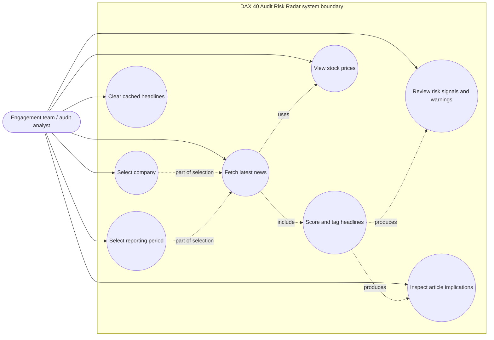

# DAX 40 Audit Risk Radar Use Case Diagram

This diagram shows the external analyst and the dashboard boundary. The actor is outside the system boundary; the use cases are inside it.

```mermaid
flowchart LR
    analyst([Engagement team / audit analyst])

    subgraph boundary["DAX 40 Audit Risk Radar system boundary"]
        direction TB
        select((Select company))
        period((Select reporting period))
        fetch((Fetch latest news))
        score((Score and tag headlines))
        review((Review risk signals and warnings))
        implications((Inspect article implications))
        prices((View stock prices))
        clear((Clear cached headlines))
    end

    analyst --> select
    analyst --> period
    analyst --> fetch
    analyst --> review
    analyst --> implications
    analyst --> prices
    analyst --> clear

    select -.->|part of selection| fetch
    period -.->|part of selection| fetch
    fetch -.->|include| score
    score -.->|produces| review
    score -.->|produces| implications
    fetch -.->|uses| prices
```