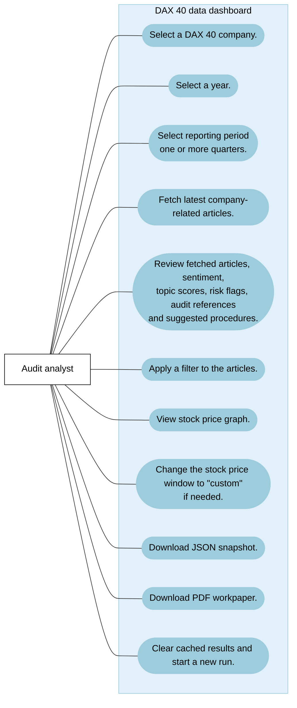

# DAX 40 Data Dashboard Use Case Diagram

```mermaid
flowchart LR
    auditor["Audit analyst"]

    subgraph dashboard["DAX 40 data dashboard"]
        direction TB
        UC01(["Select a DAX 40 company."])
        UC02(["Select a year."])
        UC03(["Select reporting period<br/>one or more quarters."])
        UC04(["Fetch latest company-related articles."])
        UC05(["Review fetched articles, sentiment,<br/>topic scores, risk flags, audit references<br/>and suggested procedures."])
        UC06(["Apply a filter to the articles."])
        UC07(["View stock price graph."])
        UC08(["Change the stock price window to &quot;custom&quot;<br/>if needed."])
        UC09(["Download JSON snapshot."])
        UC10(["Download PDF workpaper."])
        UC11(["Clear cached results and start a new run."])
    end

    auditor --- UC01
    auditor --- UC02
    auditor --- UC03
    auditor --- UC04
    auditor --- UC05
    auditor --- UC06
    auditor --- UC07
    auditor --- UC08
    auditor --- UC09
    auditor --- UC10
    auditor --- UC11

    classDef actor fill:#ffffff,stroke:#000,stroke-width:1px,color:#000;
    classDef usecase fill:#9dccdd,stroke:#9dccdd,stroke-width:1px,color:#000;
    classDef boundary fill:#e1f0fa,stroke:#9dccdd,stroke-width:1px,color:#000;

    class auditor actor;
    class UC01,UC02,UC03,UC04,UC05,UC06,UC07,UC08,UC09,UC10,UC11 usecase;
    class dashboard boundary;
```
