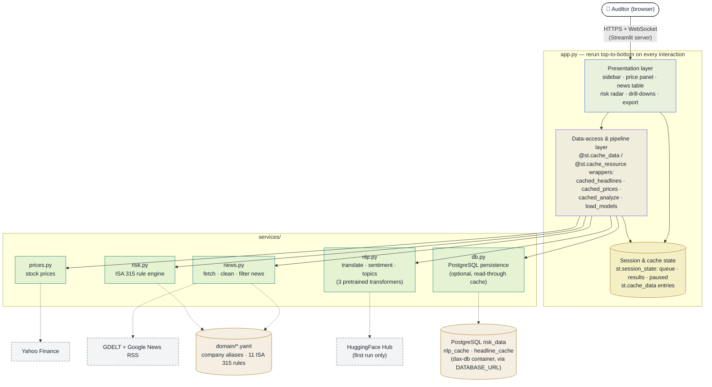

# Component Diagram

The main building blocks of the DAX 40 Audit Risk Radar and who depends on
whom. Arrows point from caller to callee.

## Legend

| Notation | Meaning |
|---|---|
| 🔵 Blue | **Presentation** — Streamlit UI code in `app.py` |
| 🟣 Violet | **Data-access & pipeline layer** — cache wrappers in `app.py` |
| 🟢 Teal | **Service module** — Python module in `services/` |
| 🟠 Amber cylinder | **Data at rest** — YAML catalogs, session/cache state |
| ⚪ Grey, dashed border | **External source** — outside the system boundary |
| `───▶` solid arrow | In-process function call |
| `╌╌╌▶` dotted arrow | Network I/O or local file read |

## Diagram

## Notes

- **Why the middle layer exists:** Streamlit re-executes `app.py` from top
  to bottom on every user interaction, so the presentation code never calls
  the service modules directly for expensive work. All network fetches and
  model inference go through `@st.cache_data` / `@st.cache_resource`
  wrapper functions (`app.py:280-435`), which return memoized results on
  reruns; `st.session_state` carries the streaming pipeline (queue,
  results, paused flag) across reruns.
- **Two cache layers:** the `@st.cache_data` wrappers memoize within the
  running process; `db.py` adds an optional PostgreSQL layer underneath
  (checked before fetching news or running models, written after), so
  transformer output and fetched headlines survive container restarts and
  redeploys. Without `DATABASE_URL` every `db.py` call is a no-op and the
  app is purely in-memory, as before.
- **Exception:** cheap, pure in-memory calls — `risk.evaluate`,
  `prices.summarize`, and the catalog loaders (`news.load_companies`,
  `risk.load_rules`) — are invoked from presentation code directly; they
  are safe and fast to re-run, so caching them would add nothing.
- Everything except the bottom row runs in **one Streamlit process**
  (packaged as a Docker container for CapRover — see
  [`deployment-diagram.md`](deployment-diagram.md)).
- `news.py` strips the publisher suffix Google News RSS appends
  (`"Headline - Source"` → `"Headline"`) at parse time, so filtering,
  dedupe, display, and the models all see the clean headline; the raw
  title is kept on each `Headline` as `title_raw` for traceability.
- `nlp.py` wraps three pretrained models (MarianMT, FinBERT,
  DeBERTa-v3-MNLI), downloaded once from HuggingFace and cached locally.
- Audit rules live in YAML (**rules-as-data**), so `risk.py` stays a thin
  engine and the catalog is reviewable without reading code.
- For how the data moves through these components, see
  [`data-flow.md`](data-flow.md).
