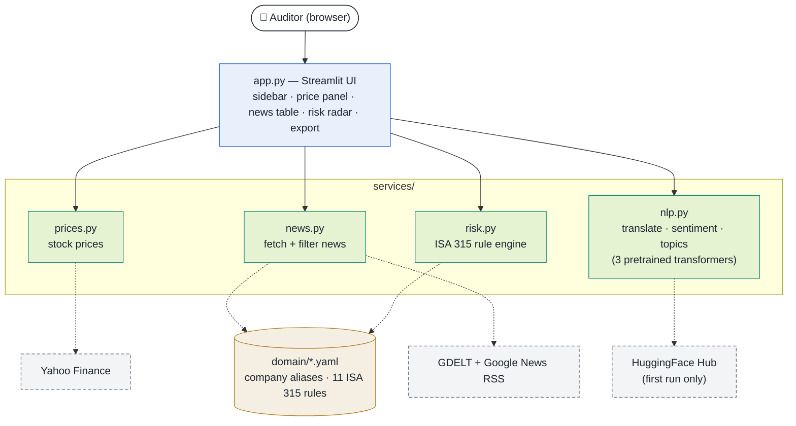

# Component Diagram

The main building blocks of the DAX 40 Audit Risk Radar and who depends on
whom. Arrows point from caller to callee.

## Legend

| Notation | Meaning |
|---|---|
| 🔵 Blue | **Presentation** — Streamlit UI (`app.py`) |
| 🟢 Teal | **Service module** — Python module in `services/` |
| 🟠 Amber cylinder | **Domain data** — YAML files (rules-as-data) |
| ⚪ Grey, dashed border | **External source** — outside the system boundary |
| `───▶` solid arrow | In-process function call |
| `╌╌╌▶` dotted arrow | Network I/O or local file read |

## Diagram

## Notes

- Everything except the bottom row runs in **one Streamlit process**.
- `nlp.py` wraps three pretrained models (MarianMT, FinBERT,
  DeBERTa-v3-MNLI), downloaded once from HuggingFace and cached locally.
- Audit rules live in YAML (**rules-as-data**), so `risk.py` stays a thin
  engine and the catalog is reviewable without reading code.
- For how the data moves through these components, see
  [`data-flow.md`](data-flow.md).
