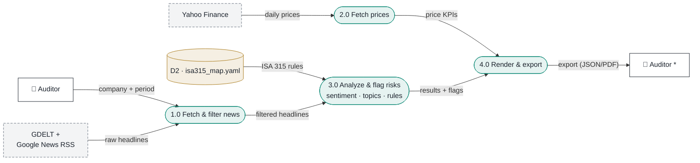

# Data Flow Diagram

How data moves through the DAX 40 Audit Risk Radar: from external sources,
through the transforming processes, to the auditor. Every arrow is labeled
with the **data** that moves (nouns); the actions live inside the numbered
processes. Control flow (loops, buttons, ordering) is intentionally
omitted — for structure see [`component-diagram.md`](component-diagram.md).

## Legend

| Notation | Meaning |
|---|---|
| ⚪ Square, dashed border | **External entity** — source or sink of data |
| 🟢 Rounded, numbered | **Process** — transforms inputs into different outputs |
| 🟠 Cylinder | **Data store** — data at rest between processes |
| Labeled arrow | **Data flow** — the named data that moves |

## Diagram

\* The Auditor appears twice — as data source (left) and data sink (right).
Duplicating an external entity to keep flows from crossing the diagram is
standard DFD practice; the asterisk marks the duplicate.

## Process descriptions

| # | Process | Transformation |
|---|---|---|
| 1.0 | Fetch & filter news | Raw headlines → company-filtered, deduped headline list |
| 2.0 | Fetch prices | Daily OHLC prices → price KPIs |
| 3.0 | Analyze & flag risks | Headline → translated + sentiment + topics → risk flags with ISA 315 references |
| 4.0 | Render & export | Results + price KPIs → risk radar dashboard and JSON/PDF workpaper |
