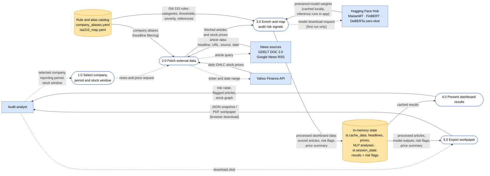

# Data Flow Diagram

How data moves through the DAX 40 Audit Risk Radar: from external sources,
through the transforming processes, to the auditor. Solid arrows carry the
**data** that moves (nouns); dashed arrows carry the **request or control
signal** that triggers a flow. For structure see
[`component-diagram.md`](component-diagram.md).

## Legend

| Notation | Meaning |
|---|---|
| ⚪ Square, dashed border | **External entity** — source or sink of data |
| 🟢 Rounded, numbered | **Process** — transforms inputs into different outputs |
| 🟠 Cylinder | **Data store** — data at rest between processes |
| `───▶` solid arrow | **Data flow** — the named data that moves |
| `╌╌╌▶` dashed arrow | **Request / control** — the trigger, not the data |

## Diagram

## Process descriptions

| # | Process | Transformation |
|---|---|---|
| 1.0 | Select company, period and stock window | Sidebar selections → fetch parameters (ticker, year + quarters, price date range) |
| 2.0 | Fetch external data | GDELT + Google News RSS headlines → publisher suffix stripped (`" - Source"`, RSS only; raw title kept) → alias-filtered, deduped list; Yahoo Finance → daily OHLC prices |
| 3.0 | Enrich and map audit risk signals | Clean headline → translated (DE→EN, MarianMT) → sentiment (FinBERT) + topic scores (DeBERTa zero-shot) → risk flags with ISA 315 references |
| 4.0 | Present dashboard results | Results + price summary → risk radar, flagged-headline drill-downs, stock graph |
| 5.0 | Export workpaper | Results + price summary → JSON snapshot and PDF workpaper, delivered as browser downloads |
