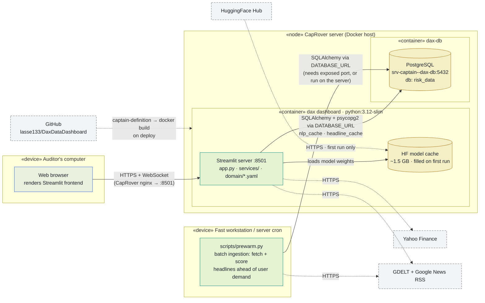

# Deployment Diagram

Physical view of the DAX 40 Audit Risk Radar deployed on a **CapRover**
server as a Docker container: which node runs what, and which protocols
connect them. The whole app — UI, services, and all three transformer
models — runs in a single container built from this repo's `dockerfile`;
the browser only renders the Streamlit frontend.

## Legend

| Notation | Meaning |
|---|---|
| Frame («device» / «node») | **Node** — a physical or virtual execution environment |
| 🟢 Teal | **Deployed artifact** — this repo's code running on the node |
| 🟠 Amber cylinder | **Data at rest** on the node (model cache, database) |
| ⚪ Grey, dashed border | **External service** — infrastructure we don't operate |
| `───▶` solid arrow | User traffic (HTTPS + WebSocket) |
| `╌╌╌▶` dotted arrow | Outbound HTTPS or the deploy pipeline |

## Diagram

## Notes

- **One app container does everything.** UI, services, and CPU-only
  transformer inference all run in the container built from `dockerfile`
  (`python:3.12-slim` + `libpq-dev`/`build-essential` for the PostgreSQL
  and rapidfuzz C-extensions). Results live in Streamlit session state
  (lost when the container restarts).
- **Deploys are CapRover-driven.** `captain-definition` (schema v2) points
  CapRover at `./dockerfile`; each deploy rebuilds the image.
  `requirements.txt` pins the CPU-only torch wheel to keep the image small.
  A Docker `HEALTHCHECK` against Streamlit's `/_stcore/health` endpoint
  tells CapRover the app is alive.
- **PostgreSQL is wired in via `services/db.py`.** A `dax-db` Postgres
  service runs on the same CapRover host (reachable to other apps as
  `srv-captain--dax-db:5432`, database `risk_data`). When `DATABASE_URL`
  is set on the dashboard app, NLP results (`nlp_cache`) and fetched
  headlines (`headline_cache`, 24h TTL) are persisted across restarts and
  redeploys. Without `DATABASE_URL` the app degrades gracefully to
  in-memory-only operation.
- **Batch ingestion path.** `scripts/prewarm.py` runs the same fetch + NLP
  pipeline outside the app — on a fast workstation or as a nightly job —
  and writes to the same two tables via `services/db.py`. Pre-warmed
  companies then load from the database instantly; users only pay for
  inference on headlines nobody has scored yet. Reaching Postgres from
  outside requires a CapRover port mapping on `dax-db` (or run the script
  on the server itself).
- **Model cache lives inside the container**, so a redeploy or restart
  discards it and the first visitor afterwards waits for the ~1.5 GB
  re-download from HuggingFace.
- Companion views: structure in
  [`component-diagram.md`](component-diagram.md), data movement in
  [`data-flow.md`](data-flow.md).
