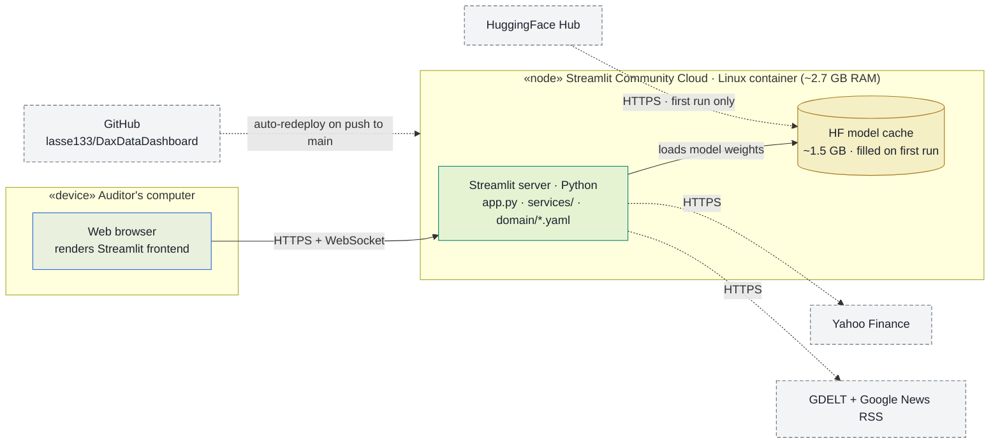

# Deployment Diagram

Physical view of the DAX 40 Audit Risk Radar deployed on **Streamlit
Community Cloud**: which node runs what, and which protocols connect them.
The whole app — UI, services, and all three transformer models — runs in a
single cloud container; the browser only renders the Streamlit frontend.

## Legend

| Notation | Meaning |
|---|---|
| Frame («device» / «node») | **Node** — a physical or virtual execution environment |
| 🟢 Teal | **Deployed artifact** — this repo's code running on the node |
| 🟠 Amber cylinder | **Data at rest** on the node (model cache) |
| ⚪ Grey, dashed border | **External service** — infrastructure we don't operate |
| `───▶` solid arrow | User traffic (HTTPS + WebSocket) |
| `╌╌╌▶` dotted arrow | Outbound HTTPS or the deploy pipeline |

## Diagram

## Notes

- **One container does everything.** There is no separate backend, database,
  or GPU — all inference runs on the container's CPU, and results live in
  Streamlit session state (lost when the container restarts).
- **Deploys are git-driven.** Streamlit Cloud watches `main` and rebuilds
  the container on every push; `requirements.txt` pins the CPU-only torch
  wheel to fit the container.
- **Sleep/wake behavior.** Free-tier containers sleep after ~12 h without
  traffic; the model cache is lost on restart, so the first visitor after a
  wake waits for the ~1.5 GB re-download from HuggingFace.
- Companion views: structure in
  [`component-diagram.md`](component-diagram.md), data movement in
  [`data-flow.md`](data-flow.md).
